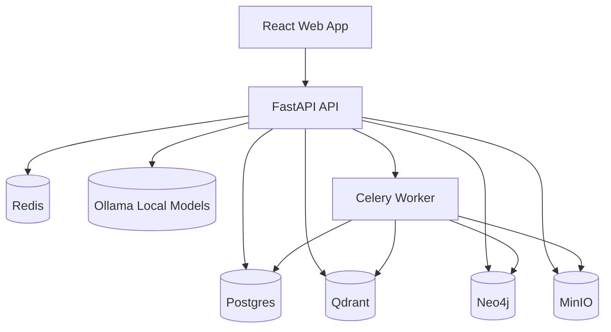
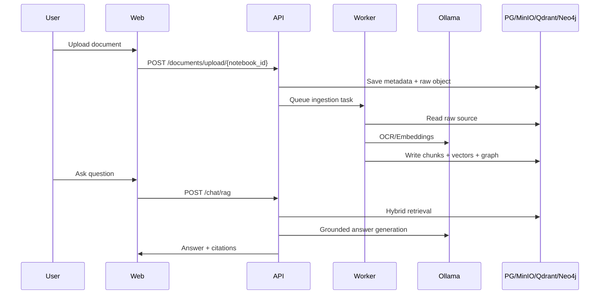

# Architecture Guide

## System Intent

Local Research Assistant is a privacy-first research workspace. All inference runs on local Ollama models. External network is optional only for source ingestion (web, GitHub, YouTube transcripts).

## High-Level Architecture

## Core Modules

### API Layer
- What: REST endpoints for auth, notebooks, ingestion, search, chat, study, graph, monitoring.
- Why: Stable contract for web client and future automation clients.
- How: FastAPI routers with dependency injection and typed Pydantic schemas.
- Design Decision: JWT + refresh token auth for stateless API security.
- Alternative Considered: Cookie-session auth. Rejected to keep API-client portability.

### Ingestion Layer
- What: Source import, parsing, OCR, chunking, embedding, indexing.
- Why: Converts heterogeneous sources into retrieval-ready knowledge objects.
- How: Synchronous metadata creation + asynchronous Celery processing pipeline.
- Design Decision: MinIO for immutable source artifacts plus DB metadata pointers.
- Alternative Considered: Local filesystem only. Rejected for weaker portability/backup.

### Retrieval Layer
- What: Hybrid semantic + lexical retrieval with reranking.
- Why: Better recall and precision than pure vector search.
- How: Qdrant vector search + Postgres full-text search + score fusion.
- Design Decision: Optional local cross-encoder reranker.
- Alternative Considered: LLM-only reranking. Rejected due latency/cost under load.

### Knowledge Graph Layer
- What: Entities and relations extracted from indexed text.
- Why: Supports relationship discovery and exploratory research.
- How: Heuristic extraction + Neo4j persistence and query APIs.
- Design Decision: Keep extraction pluggable for later NER upgrades.
- Alternative Considered: Storing graph in Postgres JSON. Rejected for query limitations.

### Study Tools Layer
- What: Study guide, flashcard, quiz generation.
- Why: Converts research corpus into learning assets.
- How: Prompted local model generation persisted in relational tables.
- Design Decision: Difficulty-level controls and notebook-scoped artifacts.
- Alternative Considered: Client-side generation. Rejected for repeatability/auditability.

## Data Flow

## Reliability and Ops
- Structured JSON logging via `loguru`.
- Prometheus metrics endpoint and Grafana dashboard.
- Redis-backed queue and retryable workers.
- Nightly backup scripts for DB/vector/graph/object stores.

